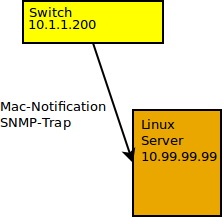
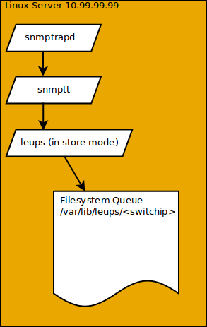
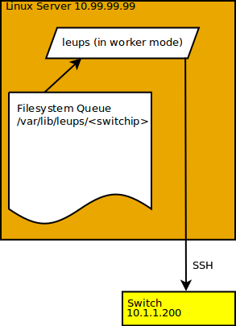

# leups
Least Effort Unattended Patching System
  
Alpha  
Version 0.2 (Alaska)  
  
# About this Document

This document gives a short overview over Leups's design and it's example implementation, done in a few lines of python.

# Why

Dynamic VLAN assignment is widely known, every network administrator got hit by the buzzword in the last years, there are hundreds of solutions out there, starting from local assignment done on the switch, by the switch, using mac-addresses or neighborship protocols like LLDP or CDP reaching to full featured database and event driven we-need-just-80gb-of-ram-systems, but if you are in an environment where stability counts most, even more than security or reducing costs all of this solutions probably passed by.  
  
So how do we configure ports on our access-switches in such an environment today?  
Well, we SSH, configure-terminal and wr-mem them.  
  
Leups could help you to get this work done, without buying installing and deploying an enterprise-grade money sink.

# Design

Cisco and a few other vendors, have a feature called Mac-Notification-Trap, as the name states, this feature sends a SNMP-Trap if a new mac-address appears in the forwarding-database of the switch, I've tested  and implemented this feature only on Cisco but with a few adaptations it should work as well for switches of other vendors like Nortel or HP.
The notification trap is great because it doesn't need any polling, you probably know why polling is bad, on some devices this is just a pain in the ass.  
Lookup CISCO-MAC-NOTIFICATION-MIB on Google, to get firm with it's features.  
  
So what does Leups do? Well let's start with a simple illustration.
  
If the switch got a new mac-address in it's mac-address-table, a mac-notification add-trap will be sent to the configured trap-receivers, this event could/would also trigger, if you just clear the mac-address-table on the switch. You can configure a delay time to summarize multiple new-macs and send them in one single-trap, here is an example config for a Cisco 2960

    conf t
        snmp-server enable traps mac-notification change
        mac address-table notification change interval 10
        mac address-table notification change
    
        snmp-server host 10.99.99.99 version 2c leups

    int range g1/0/1
        snmp trap mac-notification change added
        exit

On the receiving Linux host, you need to configure snmptrapd and snmptt to receive and process the traps sent by the switch.

Example snmptrapd.conf:

    disableAuthorization no
    donotlogtraps no
    authCommunity log,execute,net leups default .1
    traphandle default /usr/sbin/snmptt ini=/etc/snmp/snmptt.ini

Example snmptt.conf:

    EVENT cmnMacChangedNotification .1.3.6.1.4.1.9.9.215.2.0.1 "Status Events" Normal
        FORMAT This notification is generated when there is enough MAC $*
        EXEC /usr/local/leups.py --store --trapsource "$aR" --macchangedmsg "$*"
    SDESC
    EDESC

##Store-Mode Short

Leups in Store-Mode (--store), parses the receiving trap and stores the mac-addresses in a subdirectory, named by the switch-ip.

    /var/lib/leups/
    ├── 10.1.1.200
    │   ├── 000070074AC3.i
    │   ├── 000100ACF63C.i
    │   ├── 002680028F6B.i

##Worker-Mode Short

Leups in Worker-Mode (--worker), sifts through the queue (sub-directories in the filesystem) and compares the mac addresses against a data source, namely a csv-file.
If the reported access vlan differs from the access vlan in the csv-file, Leups will try, unless started in dry-run-mode (--dry-run), to login on the switch by SSH and configure the access-vlan on the port.

#Prerequisites

* Switches (Only Cisco supported, right now)
* Linux-Server
* snmptrapd
* snmptt
* python (sys, os, shutil, datetime, urllib,time,logging, csv, socket, pexpect, pxssh, logging, netaddr, daemon, subprocess, optparse)
* Datasource containing all Hosts with their mac-addresses VLANs and/or port-profiles

#Datasource
    
    leups  --show-csv-format

It doesn't matter where and how your host inventory is stored, the result have to be a csv-file (to be exact a semicolon separated file) with the following columns

    "<MAC-ADDRESS>";<UNUSED>;<UNUSED>;"<HOSTNAME>";"<VLANID>";<UNUSED>;<UNUSED>;<UNUSED>;"<PROFILE>";

It's recommended to generate this csv file automatically as fast as possible and put it on an accessible web-server, so that leups can fetch this file via HTTP.

#Details

##Updater-Mode

    leups.py --updater –csv-url=<HTTPURL>

Leups updater-mode fetches a csv-file containing valid hosts (with mac-addresses and port-profiles) from a HTTP-Url and stores it to the Leups working directory (/var/lib/leups/mac2vlan.csv).

Updater mode should be scheduled by cron in a reasonable interval, like every 10 minutes. 
   
That's it job done for Leups in updater mode.  

##Store-Mode

    leups –store -trapsource=<TRAPSOURCE>

Leups of course always do some basic checks on starting, the store-mode has 3 requirements. first you need a valid trapsource ip-address specified by the argument –trapsource, second the config directory must exist, third a scopes.csv file within the config directory must exist.  
  
Leups receives the trap from snmptt, and checks if the ip-address got by the trapsource argument is in one of the ip-subnet-scopes specified in the scopes.csv file, if not there will be no further parsing and of course no storing of the incoming data, so if you switch ip-address (snmp trap sender) is not in one of scopes in the scopes.csv file, or the the scopes.csv files doesn't even exist, you don't have to worry about Leups going mad.  
If every of the above mentioned checks succeeds, Leups will parse the mac-addresses and VLAN information of the received snmp-notification trap (multiple records in one trap are supported). For each mac-address Leups will generate a queue-item, namely a file in the filesystem.

    /var/lib/leups/
    ├── 10.1.1.200
    │   ├── 000070074AC3.i
    │   ├── 000100ACF63C.i
    │   ├── 002680028F6B.i

A sub-directory for every switch ip-address (trapsource) will be created, within this sub-directory Leups generates text files named by the mac-address in uppercase and suffixed by an “.i” to mark the file as incoming.
Within these text-files the additional data received by a snmp-notification trap is stored as one value per line, first line the access-vlanid reported by the switch, second line the ifIndex.  
  
That's it job done for Leups in store mode.

##Worker-Mode

Leups of course always do some basic checks on starting, the worker-mode has the following requirements.  It needs a existing config directory with a scopes.csv file within, after successfully loading the ip-address ranges from the scopes file, Leups try to load existing interface profiles, if there are any. An interface profile is a text-file which must exist in the profiles directory of the config directory (/etc/leups/profiles).
If you want, you can create some example profiles by executing leups –create-example-profile.  
The profile contains the config which could be applied by Leups on an specific switch-port/interface.

Example for an IP-Phone:  
  
    interface $INTERFACE$
        desc vo_$DESC$
        switchport mode access
        switchport nonegotiate
        switchport access vlan $VLANID$
        switchport voice vlan $VOICEVLANID$
        no switchport trunk native vlan
        no switchport trunk allowed vlan
        no switchport port-security
        no macro description
        no macro auto processing
        speed auto
        no vtp
        no cdp enable
        ip dhcp snooping limit rate 30
        storm-control broadcast level 5.00
        spanning-tree portfast
        load-interval 60

As you can see there are some replacement variables within this example, replacement variables are specified by surrounding the variable name with $ signs. You can print valid replacement variables by executing leups.py – show-profile-replacementvars.  
After this basic checks, the worker mode will start and run „forever“ in a loop.

In worker-mode Leups reads the csv-file fetched by the updater-mode (the csv file containing your host, vlan and profile information) on every pass, if the file isn't there or couldn't be parsed Leups will skip the rest of it's actions and sleeps for a little longer than after a non-error run-through.  
If the file can be parsed successfully Leups iterates over the directories in the working directory (/var/lib/leups) there should be a sub-directory for every switch-ip, created by Leups in store-mode, containing files with the mac-addresses received in store-mode.

Leups now compares every mac-address received and stored in the queue with the mac-addresses in the csv-file, if the mac-address is found in the csv file and the reported vlan-id of the switch differs from the vlan-id in the csv file, Leups will try to configure the switch-port.
After Leups has decided to configure a switch, first the scopes file will be read, to check if the switch-ip is in one of the subnets defined within the scopes file, the scopes file could have been changed since the store-mode validated and stored the mac notification trap, so it's checked a second time.  
The scopes file contains the SSH access credentials of the switches, this is the second reason to reread the scopes file, because Leups doesn't want to know any credentials as long as it is not decided if a configure action is needed or not.  
Since Leups doesn't want to poll anything by SNMP nor store any data except the data received by traps, Leups need to login to the switch and execute a „show mac address-table“ to find the name of the port/interface for the mac-address, this should be very fast, but is also dangerous.  
  
Why dangerous?  
  
Let's give an example. You have enabled the mac-notification trap on a few access-ports of the switch.   
Leups receive this trap in store mode and writes it to the filesystem queue, for some reason the Leups worker-mode read this file let's say 10 minutes after Leups has stored it.  
In the meanwhile the client which triggered the mac-notification moved to another switch, so the switch Leups tries to configure learned the mac-address on the uplink-port, Leups would get the uplink-port, as name of the interface from the „show mac address-table“ command, well, I guess you know what would happen next.   
Therefore we need to tell Leups which interface names are valid ones, or which are invalid ones, or rely on the some other live information like CDP or LLDP neighborhship information. 
This really depends on the environment, for example if your uplinks are always port-channels, it would be the easiest way to exclude interfaces containing Po or Port-Channel in their name.

# References & External links
